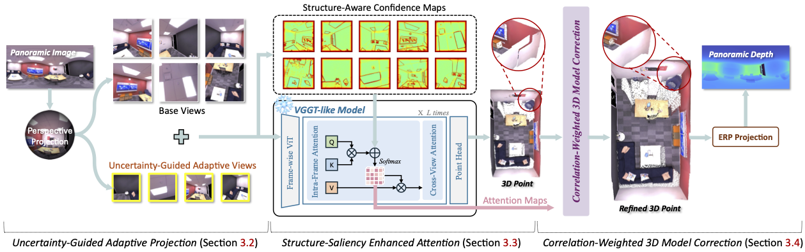

<h1 align="center"> <em>VGGT-360</em>: Geometry-Consistent Zero-Shot Panoramic Depth Estimation</h1>

<div align="center">
    <p>
        <a href="https://scholar.google.com/citations?user=BjQbZ_wAAAAJ&hl">Jiayi Yuan</a><sup>1</sup>&nbsp;&nbsp;
        <a href="https://scholar.google.com/citations?hl=zh-CN&user=xRN1zIEAAAAJ">Haobo Jiang</a><sup>2</sup>&nbsp;&nbsp;
        <a href="https://scholar.google.com/citations?hl=zh-CN&user=MKRbJDEAAAAJ">De Wen Soh</a><sup>1</sup>&nbsp;&nbsp;
        <a href="https://scholar.google.com/citations?hl=zh-CN&user=KOL2dMwAAAAJ">Na Zhao</a><sup>1</sup>&nbsp;&nbsp;
        <br>
    </p>
    <p>
        <sup>1</sup>Singapore University of Technology and Design 
        <sup>2</sup>Nanyang Technological University &nbsp;&nbsp;
    </p>
</div>


<div align="center">
    <a href="[PROJECT_PAGE_LINK_HERE]">
        
    </a>
    <p>
        <i> We propose VGGT-360, a novel training-free, 3D model-aware framework that exploits the global consistency of VGGT-like 3D foundation models for coherent panoramic depth estimation.</i>
    </p>
</div>


## 🚀 Quick Start

### 1. Clone & Install Dependencies

First, please clone the repository to the local machine and install the required dependencies.
```
git clone https://github.com/Yuanjiayii/VGGT-360.git
cd VGGT-360
pip install -r requirements.txt
```
### 2. Data Preparation
Please download the benchmark datasets:
    [Matterport3D](https://niessner.github.io/Matterport/),
    [Stanford2D3D](https://github.com/alexsax/2D-3D-Semantics),
    [Replica2K](https://github.com/manurare/360monodepth)
, and place them in [`/datasets/data`](https://github.com/Jiang-HB/FUSER/benchmarks/datasets/data) folder.

### 3. Install the 3D foundation model (We take [VGGT](https://github.com/facebookresearch/vggt) as an example)
```
git clone git@github.com:facebookresearch/vggt.git 
pip install -r requirements.txt
```

### 4. Run Inference
```
python main.py --data_path <path/to/data> --model_name VGGT
```


## 📜 Citation

If you find this repository useful, please cite:

```bibtex
@InProceedings{Yuan_2026_CVPR,
    author    = {Yuan, Jiayi and Jiang, Haobo and Soh, De Wen and Zhao, Na},
    title     = {VGGT-360: Geometry-Consistent Zero-Shot Panoramic Depth Estimation},
    booktitle = {Proceedings of the IEEE/CVF Conference on Computer Vision and Pattern Recognition (CVPR)},
    year      = {2026},
}
```

## 🙏 Acknowledgements

**We sincerely appreciate the following research / code / datasets that made our research possible**

- [Depth-Anywhere](https://github.com/albert100121/Depth-Anywhere)
- [VGGT](https://github.com/facebookresearch/vggti)
- [360MonoDepth](https://github.com/manurare/360monodepth)
